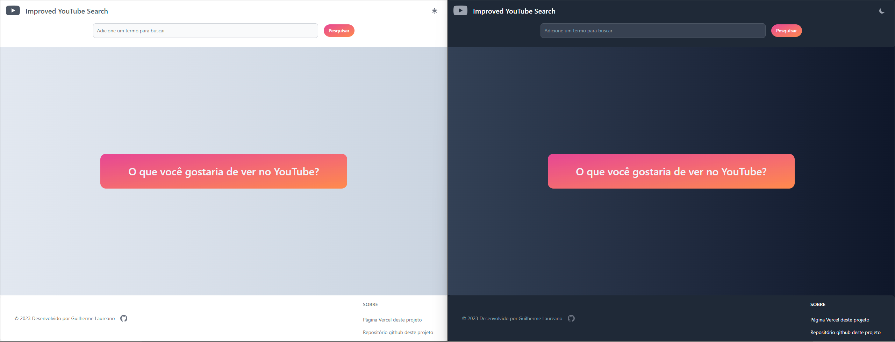
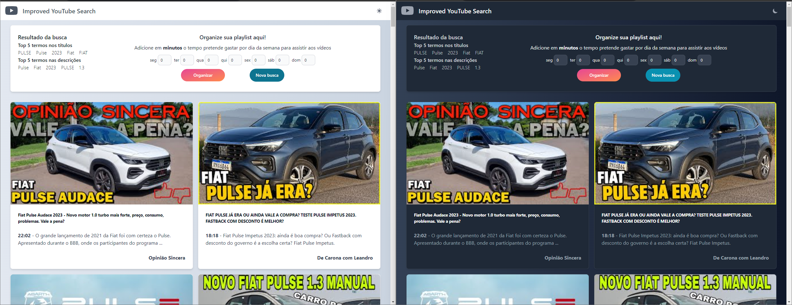

# Comentário sobre o desafio

## Processo de densevolvimento

Iniciei o processo de desenvolvimento separando as tarefas em partes menores e aproveitei a ferramenta de projetos disponibilizada pela github para organizar as tarefas em um quadro, [@guilhermelaureano's improved-youtube-search project](https://github.com/users/guilhermelaureano/projects/1), e assim, poder vizualizar melhor cada etapa da tarefa que teria que atuar.

Gostei de trabalhar com a estrutura disponibilizada pelo [NextJS](https://nextjs.org/) e de usar [Tailwind](https://tailwindui.com/) e [Flowbite]() junto com o [ReactJS](https://react.dev/).

A utilização do Nextjs + Vercel junto ao github proporcionou que fosse possivel chegar até o final do processo, com o deploy da aplicação, disponível [`aqui`](https://improved-youtube-search-git-main-guilhermelaureano.vercel.app/).

Para buscar os dados, em um primeiro momento, optei por usar a função featch do JS, mas no fim acabei optando por usar a facilidade do [Axios](https://axios-http.com/), detalho a experiência no item abaixo.

## Desafios encontrados

Em um primeiro momento optei em utilizar o formato de arquivo em JavaScript, o que no passar do tempo, me fez refletir e constatar que foi um equivoco e que a utilização de TypeScript seria o mais correto e que certamente será um próximo passo de melhoria para o projeto.

Outro ponto foi a utilização da [API do YouTube](https://developers.google.com/youtube/v3/docs/videos/list?hl=pt-br), eu ainda não tinha utilizado o serviço. Este projeto consome dois endpoints. Para o primeiro endpoint utilizado para realizar a busca de vídeos através de um determinado termo, foi utilizado o [`search`](https://developers.google.com/youtube/v3/docs/search). O segundo endpoint foi o de [`video`](https://developers.google.com/youtube/v3/docs/videos), o qual foi utilizado para buscar mais informações sobre cada vídeo atráves de uma lista com os `ids` dos vídeo.

A parte de testes foi um ponto que senti falta e que fiquei devendo, a intenção é de poder retomar isso junto com uma refatoração para TypeScript.

---

# improved-youtube-search

- Project created to present an improved search in the results of YouTube videos.
- This project consumes the [YouTube Data API v3](https://developers.google.com/youtube/) to fetch data and show the videos.

* Welcome
  
* After search
  

---

# Run project on a GitHub Codespace:

## Node version

Install the node version used in the project.

```bash
nvm install
```

## Install project

To install the necessary project dependencies, run the command:

```bash
npm install
```

## File .env.local

Create a `.env.local` file in the root folder of the project using the `.env.local.example` file. It will be necessary to create an [apikey](https://developers.google.com/youtube/v3/getting-started?hl=pt-br) in the [google cloud](https://console.cloud.google.com/) service and add it in the field indicated in the `.env.local.example` file.

## Run the project

To run the project use the command.

```bash
npm run dev
```

---

# Run project on a local machine

## First steps

To use this app you must clone, install and run the project [improved-youtube-search](https://github.com/guilhermelaureano/improved-youtube-search).

Create a `.env.local` file in the root folder of the project using the `.env.local.example` file. It will be necessary to create an [apikey](https://developers.google.com/youtube/v3/getting-started?hl=pt-br) in the [google cloud](https://console.cloud.google.com/) service and add it in the field indicated in the `.env.local.example` file.

## Next steps

This is a [Next.js](https://nextjs.org/) project bootstrapped with [`create-next-app`](https://github.com/vercel/next.js/tree/canary/packages/create-next-app).

## Getting Started

First, run the development server:

```bash
npm run dev
# or
yarn dev
# or
pnpm dev
```

Open [http://localhost:3000](http://localhost:3000) with your browser to see the result.

You can start editing the page by modifying `pages/index.tsx`. The page auto-updates as you edit the file.

[API routes](https://nextjs.org/docs/api-routes/introduction) can be accessed on [http://localhost:3000/api/hello](http://localhost:3000/api/hello). This endpoint can be edited in `pages/api/hello.ts`.

The `pages/api` directory is mapped to `/api/*`. Files in this directory are treated as [API routes](https://nextjs.org/docs/api-routes/introduction) instead of React pages.

This project uses [`next/font`](https://nextjs.org/docs/basic-features/font-optimization) to automatically optimize and load Inter, a custom Google Font.

## Learn More

To learn more about Next.js, take a look at the following resources:

- [Next.js Documentation](https://nextjs.org/docs) - learn about Next.js features and API.
- [Learn Next.js](https://nextjs.org/learn) - an interactive Next.js tutorial.

You can check out [the Next.js GitHub repository](https://github.com/vercel/next.js/) - your feedback and contributions are welcome!

## Deploy on Vercel

The easiest way to deploy your Next.js app is to use the [Vercel Platform](https://vercel.com/new?utm_medium=default-template&filter=next.js&utm_source=create-next-app&utm_campaign=create-next-app-readme) from the creators of Next.js.

Check out our [Next.js deployment documentation](https://nextjs.org/docs/deployment) for more details.
